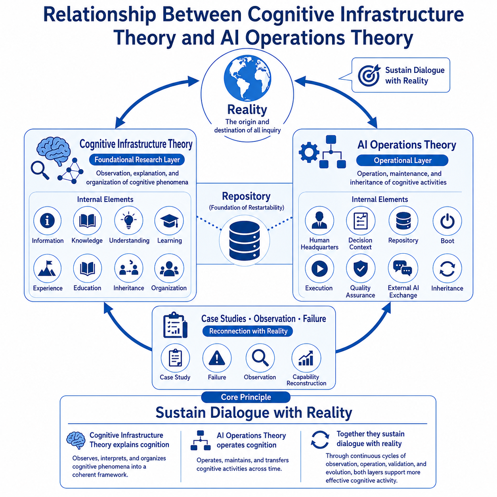

# Cognitive Infrastructure

Research archive for Cognitive Infrastructure Theory and AI Operations Theory.

## Overview

Cognitive Infrastructure Theory is a foundational research framework that observes and organizes cognitive activities.

AI Operations Theory focuses on how humans and AI can operate, maintain, and inherit cognitive activities while sustaining dialogue with reality.

Together, the two theories are positioned as complementary layers within a continuous cycle of Reality Observation.

## Repository Structure

- Cognitive Infrastructure Theory
- AI Operations Theory
- Common

## Origin of Research

Cognitive Infrastructure Theory and AI Operations Theory originated from observations of inheritance, knowledge management, and operational structures conducted through the prior research project:

[Rune Factory Inheritance Research](https://github.com/j13343sh/Rune-Factory-Inheritance-Research)
