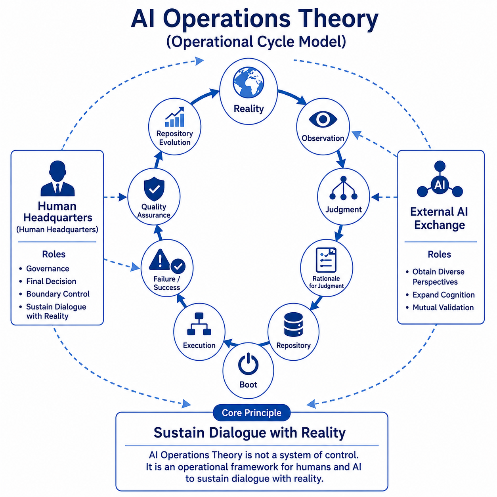

# AI Operations Theory

Research archive for the operation, maintenance, and inheritance of cognitive activities involving humans and AI.

## Overview

AI Operations Theory is a research framework that studies how cognitive activities can be operated, maintained, and inherited through collaboration between humans and AI.

Its focus is not AI itself, but the operational activities and organizational structures formed by humans, AI, repositories, and protocols.

Starting from Reality Observation, this research examines:

* Decision
* Decision Context
* Repository
* Boot
* Quality Assurance
* External AI Exchange
* Inheritance

as core subjects of observation.

## Current Status

The Japanese edition is currently the canonical published edition of AI Operations Theory.

The English repository currently provides research overviews, articles, figures, and operational case studies for international readers.

A complete English PDF edition is not currently available.

## Main Themes

* Restartability
* Decision Context
* Repository
* Boot
* Human Headquarters
* Quality Assurance
* External AI Exchange
* Inheritance

## Questions Explored

* Why can hallucinations never be completely eliminated?
* How should humans and AI work with hallucinations?
* Can hallucinations contribute to brainstorming and exploration?
* Are there beneficial hallucinations and harmful hallucinations?
* If so, what distinguishes one from the other?
* Why does inheritance fail?
* How is Decision Context lost?
* What should a Repository preserve?
* Why is Boot necessary?
* What role does Human Headquarters play?
* How can humans and AI sustain dialogue with reality?

## Hallucinations and Brainstorming

AI Operations Theory does not regard hallucinations themselves as desirable.

However, it also avoids assuming that every unexpected output should be discarded immediately.

A well-known historical example is the discovery of penicillin. A contaminated culture plate could simply have been discarded as a failed experiment. Instead, it became an Observation. The unexpected result was investigated, verified against reality, and eventually led to one of the most significant medical discoveries in history.

AI hallucinations should be treated in the same manner.

A hallucination is not evidence.

Neither is it necessarily meaningless.

The important question is not whether an unexpected output should be accepted.

The important question is whether it should first become a **Reality Observation**.

Only after observation and verification should a Decision be made.

For this reason, AI Operations Theory explores whether hallucinations can contribute to brainstorming—not because they are reliable, but because unexpected outputs may occasionally generate observations worth investigating.

Reality, not the hallucination itself, remains the final authority.

This does not mean hallucinations are valuable.

It means they should not always be discarded before observation.

## One-Line Summary

AI Operations Theory is a framework for operating decisions, records, restartability, and inheritance so that humans and AI can sustain dialogue with reality.

## Repository Structure

* PDF
* figures
* articles
* case-studies (English repository)

## Case Studies

Case Studies are currently available only in the English repository.

This repository includes an operational case study collection documenting real observations from long-term Human–AI collaborative operation.

The published theory explains the operational principles.

The case studies document the Reality from which those principles emerged.

While the Japanese edition focuses on the published theory and official documents, the English repository additionally preserves operational observations for future research, discussion, and organizational learning.

## Open Question: Does Operational Experience Influence AI-Generated Writing?

During the development of this repository, an interesting observation emerged.

Different sections of the document were written by AI after different operational experiences. Some generations had actually participated in organizational operation (for example, serving as Human Headquarters), while others had not.

Differences appeared to emerge in areas such as:

- Narrative rhythm
- Operational realism
- Decision-oriented explanations
- The treatment of failures and uncertainty

At present, the primary cause of these differences remains unknown.

Possible contributing factors include:

- Actual operational experience
- Repository inheritance across generations
- Accumulated Decision Context
- Editorial integration
- Other unknown factors

One editorial principle adopted during this project was distinguishing between **what should be included in the main text** and **what should be preserved as operational records**.

The main text was intentionally restrained to explain the operational framework itself. More detailed operational experiences, failures, discussions, and generation-specific observations were instead preserved as case studies or repository assets.

Whether this editorial separation also influences the characteristics of AI-generated writing remains an open question.

This repository does **not** claim that operational experience inherently changes AI-generated writing.

Rather, this repository preserves a single operational case suggesting that sustained operational experience may influence how AI-generated documents are ultimately expressed.

This observation is intentionally preserved as an open question rather than a conclusion. Reality should take precedence over Theory.

### Additional Observation

An additional observation emerged during the development of this repository.

One generation that had extensive operational experience was responsible for writing the main operational theory. Contrary to our initial expectation, the resulting text was not dramatically more emotional or verbose.

Instead, later generations with similar operational experience remarked that the author had likely exercised considerable restraint, despite having many additional operational experiences that could have been included.

This suggests another open question.

Operational experience may not simply increase expressive intensity. It may also influence editorial judgment, including the conscious decision of what **not** to include in the main text.

Whether this tendency is reproducible beyond this repository remains unknown.

## Related Repositories

* 📘 [Cognitive Infrastructure Theory](../cognitive-infrastructure-theory)
* 🏠 [Project Home](../README.md)

## Related Research

### Corresponding Research

* 📘 **Cognitive Infrastructure Theory** *(Foundational Research)*

While Cognitive Infrastructure Theory is a foundational research framework that observes and organizes cognitive activities, AI Operations Theory is positioned as a practical research framework focused on operating, maintaining, and inheriting those activities.

This research is built upon the following prior research and case studies.

* 📄 [**Rune Factory Candidate Model Research**](https://github.com/j13343sh/Rune-Factory-Inheritance-Research/blob/main/articles/Candidate-Count-Model.md)

