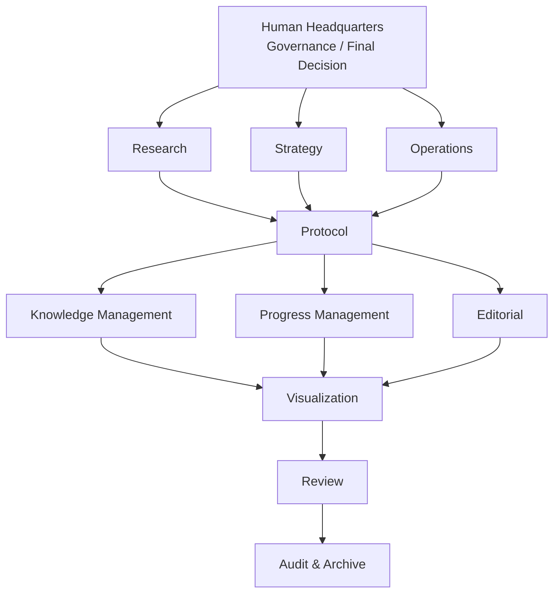
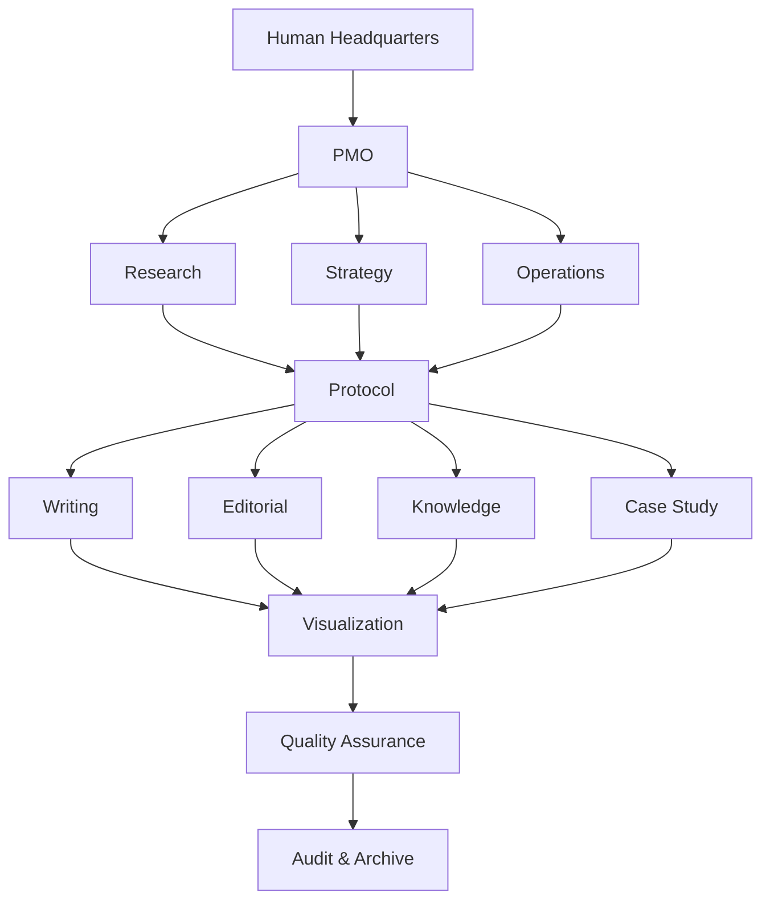

# CS-028 Initial Organizational Proposals Before Operational Validation

## Overview

Before Pilot-001 began, both Cognitive Infrastructure Theory and AI Operations Theory proposed organizational structures that were significantly more specialized than the structures ultimately adopted.

These proposals were created as discussion frameworks rather than finalized operational designs.

They represented an attempt to assign clear responsibilities to every major operational function.

At the time, these organizational structures appeared theoretically comprehensive.

However, they had not yet been validated through actual operation.

---

## Background

The original expectation was that organizational design would mature through repeated discussion.

Multiple AI generations were expected to:

* Review organizational responsibilities.
* Exchange opinions across projects.
* Refine organizational boundaries.
* Gradually converge toward an optimal organizational structure.

Operational experience was not initially considered necessary.

The assumption was that sufficiently detailed discussion would eventually produce an effective organization.

---

## Initial Proposal — Cognitive Infrastructure Theory

### Organizational Structure

### Proposed Divisions

| Division             | Primary Mission                                |
| -------------------- | ---------------------------------------------- |
| Human Headquarters   | Governance and final decision making           |
| Research             | Observation, verification, model construction  |
| Strategy             | Direction, prioritization, long-term planning  |
| Operations           | Implementation and maintenance                 |
| Protocol             | Constitution, Boot, inheritance and governance |
| Knowledge Management | Canonical sources and version management       |
| Progress Management  | Dashboard, milestones and blockers             |
| Editorial            | Document organization and readability          |
| Visualization        | Diagrams and conceptual visualization          |
| Review               | Peer review and logical consistency            |
| Audit & Archive      | Decision logs, drift detection and archival    |

---

## Initial Proposal — AI Operations Theory

### Organizational Structure

### Proposed Divisions

| Division             | Primary Mission                             |
| -------------------- | ------------------------------------------- |
| Human Headquarters   | Final governance                            |
| PMO                  | Project coordination                        |
| Research             | Theory development                          |
| Strategy             | Long-term architecture                      |
| Operations           | Practical execution                         |
| Protocol             | Constitution and operational rules          |
| Writing              | Draft writing                               |
| Editorial            | Editing and restructuring                   |
| Knowledge Management | Canonical source management                 |
| Case Study           | Operational case management                 |
| Visualization        | Figures and conceptual diagrams             |
| Quality Assurance    | Review and quality assurance                |
| Audit & Archive      | Operational auditing and historical records |

---

## Initial Impression

Both organizational structures appeared comprehensive.

Every operational responsibility had an assigned division.

Every division had a clearly defined mission.

From a theoretical perspective, the designs appeared complete.

The remaining question was unexpectedly simple.

> **Who would actually operate this organization?**

At the time, this question remained largely unanswered.

---

## Operational Problem

The project gradually realized that the central problem was no longer organizational completeness.

It was operational feasibility.

The question became:

> Which organizational structure can actually be operated by Human Headquarters over the long term?

---

## Pilot-001 Design

The organizational proposals themselves had largely been generated by AI.

From a theoretical perspective, they appeared comprehensive and internally consistent.

Human Headquarters, however, immediately recognized a different concern.

The question was no longer whether the organizational structure was logically complete.

The question became whether it could actually be operated by a human coordinator over an extended period.

Rather than rejecting the proposals outright, Human Headquarters chose a different approach.

Instead of continuing theoretical discussion, the AI generations that had participated in the organizational design were invited to operate the proposed structure themselves.

This decision later became known as **Pilot-001**.

One generation immediately volunteered to participate.

Another accepted the assignment cautiously, explicitly stating that it had no confidence that such a highly specialized organization could be sustained in practice.

Despite these different initial attitudes, both operational experiences gradually converged toward a similar conclusion.

Long-term operation favored a significantly smaller number of permanent organizational roles.

Operational experience, rather than theoretical discussion, became the decisive source of organizational design.

---

## Operational Reality

Pilot-001 later revealed that the organizational charts described responsibilities, but not operational cost.

Several practical constraints immediately became apparent.

* Human Headquarters became the coordination bottleneck.
* Context switching increased rapidly.
* Coordination overhead grew faster than organizational benefits.
* Human errors still occurred despite increased specialization.
* Organizational complexity exceeded practical operational capacity.

These observations could not have been predicted from organizational diagrams alone.

They emerged only after actual operation began.

None of the proposed organizational structures were abandoned because they were conceptually incorrect.

Instead, they were gradually simplified as operational experience revealed the practical limits of long-term coordination.

---

## Decision Context

The purpose of Pilot-001 was therefore not simply to test AI operation.

Its purpose was to determine whether these organizational structures could actually be operated over the long term.

The question shifted from:

> "Is this organizational structure theoretically complete?"

to

> "Can this organizational structure actually be operated?"

This shift fundamentally changed how organizational design was evaluated throughout the project.

Although the selected divisions differed slightly between the two projects, the differences primarily reflected project-specific organizational terminology rather than fundamentally different operational priorities.

In both cases, Human Headquarters selected a small set of operational roles that collectively covered research, strategic decision-making, implementation, and governance.

The observation therefore suggested convergence in operational function rather than identical organizational labels.

### Operational Role Selection

During Pilot-001, Human Headquarters did not attempt to operate every proposed organizational division.

Instead, each project selected a limited number of operational roles considered sustainable for long-term operation.

**Cognitive Infrastructure Theory**

- Research
- Strategy
- Operations
- Protocol

**AI Operations Theory**

- Research
- Strategy
- Writing
- Audit

Although the selected division names were not identical, the differences primarily reflected project-specific organizational terminology rather than fundamentally different operational priorities.

For example, **Operations** and **Writing** both represented the project's primary implementation role, while **Protocol** and **Audit** fulfilled closely related governance and organizational oversight functions within their respective projects.

The observation therefore suggested convergence in operational function rather than identical organizational labels.

The organizational structures evolved around a small number of sustainable operational responsibilities rather than preserving every initially proposed specialized division.

---

## Relation to CS-027

CS-027 explains why operational experience replaced prolonged organizational discussion.

This case study documents the organizational proposals that existed immediately before that transition.

Together, they illustrate how theoretical organizational design evolved into operational organizational design through direct experience.

---

## Key Takeaways

* Initial organizational proposals emphasized theoretical completeness.
* Organizational diagrams did not reveal operational cost.
* Human Headquarters emerged as the primary operational constraint.
* Pilot-001 was introduced to validate organizational operation rather than organizational theory.
* Long-term operational sustainability became more important than organizational specialization.
