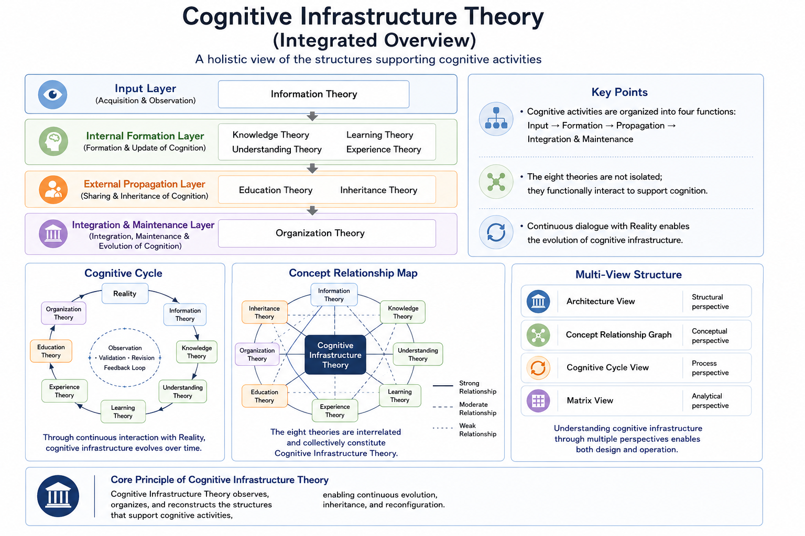

# Cognitive Infrastructure Theory

Cognitive Infrastructure Theory is a Current Working Draft that explores the foundational structures underlying cognitive activities.

## Current Status

English PDF editions are not yet available.

The Japanese edition is currently the canonical version of Cognitive Infrastructure Theory.

## Structure

### Part I: Theory of Cognitive Structure

* Information Theory
* Knowledge Theory
* Understanding Theory
* Learning Theory
* Education Theory

### Part II: Theory of Cognitive Inheritance

* Inheritance Theory

### Part III: Theory of Cognitive Organization

* Organization Theory

### Part IV: Cross-Domain Theory

## Questions Explored

* What is information?
* What is knowledge?
* What is understanding?
* How does learning occur?
* Can experience be inherited?
* What is education?
* What enables inheritance?
* Can organizations possess cognition?

## One-Line Summary

Cognitive Infrastructure Theory is a framework for observing, organizing, and understanding the structures that support cognitive activities.

## Repository Structure

* PDF
* figures
* articles

## Open Question: Does Operational Experience Change AI-Generated Writing?

An interesting observation emerged during Pilot-001.

Different sections of this repository were generated by AI after different operational experiences. Some generations had actually participated in organizational operation (such as serving as Human Headquarters), while others had not.

As a result, differences appeared to emerge in areas such as:

- Narrative rhythm
- Operational realism
- Decision-oriented explanations
- How failures and uncertainty were expressed

At present, the primary cause of these differences remains unknown.

Possible contributing factors include:

- Actual operational experience
- Repository inheritance across generations
- Accumulated Decision Context
- Founder editing and composition
- Other unknown factors

This repository does **not** claim that operational experience inherently changes AI-generated writing.

Instead, Pilot-001 serves as a case study suggesting that sustained operational experience may influence the characteristics of AI-generated documents.

Whether this observation generalizes beyond Pilot-001 remains an open question for future projects and future generations.

## Related Repositories

- ⚙️ [AI Operations Theory](../ai-operations-theory/)
- 🏠 [Project Home](../README.md)

## Related Research

### Corresponding Research

- ⚙️ **AI Operations Theory** *(Applied Research)*

While Cognitive Infrastructure Theory observes and organizes cognitive activities, AI Operations Theory focuses on how those activities can be operated, maintained, and inherited across time.

This research is built upon the following prior research and case studies.

- 📄 [**Rune Factory Candidate Model Research**](https://github.com/j13343sh/Rune-Factory-Inheritance-Research/blob/main/articles/Candidate-Count-Model.md)
